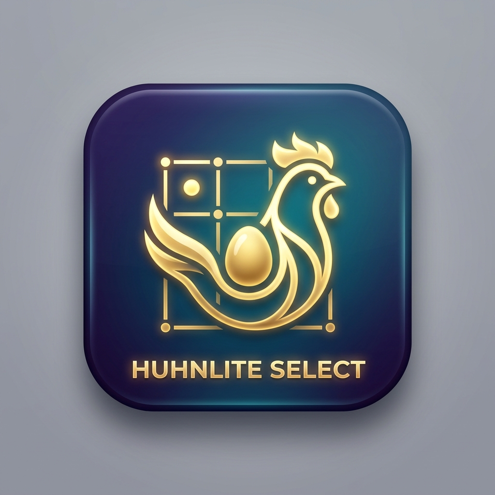

# 🐔 HuhnLite-Select

> **Der intelligente Mandanten-Launcher und Server-Manager für HuhnLite**

---

## 📌 Übersicht & Zweck

**HuhnLite-Select** ist das zentrale Vorschaltprogramm (Launcher) für die HuhnLite-Softwarefamilie. Es ermöglicht Benutzern und Betrieben, vor dem eigentlichen Start der Hauptanwendung den gewünschten **Mandanten** (Betrieb, Datenbestand oder Filiale) übersichtlich auszuwählen.

Das Programm läuft als extrem schlanker, performanter Go-Server mit einer integrierten, modernen Web-Oberfläche (Vue 3 / Quasar).



---

## ✨ Hauptfunktionen

- 🏢 **Multi-Mandanten-Verwaltung:** Automatische Erkennung aller konfigurierten Mandanten (z. B. *Otto Dotter*, *Gustav Hahn*) aus den `settings_select.json` oder `settings_server.json` Dateien.
- ⚡ **Echtzeit-Statusprüfung:** Prüft via Port-Scan kontinuierlich, ob der Server für den ausgewählten Mandanten bereits aktiv ist.
- 🚀 **Automatischer Serverstart:** Startet inaktive Mandanten-Server im Hintergrund mit den passenden Parametern (Port & Mandanten-ID) und leitet den Benutzer nach dem Start automatisch weiter.
- 🌐 **Mehrsprachige Benutzeroberfläche:** Unterwegs umschaltbar zwischen **Deutsch (DE)**, **Englisch (EN)** und **Italienisch (IT)**. Die Einstellung wird dauerhaft im Browser gespeichert.
- 🌙 **Dark / Light Mode:** Umschaltbarer Tag- und Nachtmodus für optimalen Sehkomfort.
- 📦 **Single-Binary (Keine Installation):** Sämtliche Frontend-Ressourcen sind direkt in die ausführbare Datei einkompiliert. Es werden keine externen Webserver oder Zusatzdateien benötigt.

---

## 🚀 Schnellstart (Für Endanwender)

1. **Programm starten:**
   Führen Sie die Datei `HuhnLite-Select.exe` (oder die entsprechende Binärdatei für Ihr Betriebssystem) aus.
2. **Browser-Ansicht:**
   Ihr Standard-Webbrowser öffnet sich automatisch unter `http://localhost:8080`.
3. **Mandanten auswählen:**
   Klicken Sie auf die Kachel des gewünschten Betriebes/Mandanten:
   - **Grüner Status (Aktiv):** Sie werden sofort zum Mandanten weitergeleitet.
   - **Grauer Status (Inaktiv):** Der Launcher startet den Mandanten-Server automatisch und leitet Sie nach wenigen Sekunden weiter.

---

## ⚙️ Konfiguration & Multi-Server-Varianten (`MariaDB`, `Postgres`, etc.)

HuhnLite-Select erkennt anhand seines **eigenen Dateinamens** automatisch, welche Datenbank- bzw. Servervariante und welche Konfigurationsdatei verwendet werden soll. Sie können die ausführbare Datei einfach kopieren und umbenennen:

| Dateiname der Anwendung | Suchreihenfolge der Settings-Dateien | Standard-Server-Executable |
| :--- | :--- | :--- |
| **`HuhnLite-Select-MariaDB.exe`** | 1. `settings_server_mariadb.json`<br>2. `settings_select_mariadb.json`<br>3. `settings_server.json` / `settings.json` | `HuhnLite-Server-MariaDB.exe`<br>*(Fallback: `HuhnLite-Server.exe`)* |
| **`HuhnLite-Select-Postgres.exe`** | 1. `settings_server_postgres.json`<br>2. `settings_select_postgres.json`<br>3. `settings_server.json` / `settings.json` | `HuhnLite-Server-Postgres.exe`<br>*(Fallback: `HuhnLite-Server.exe`)* |
| **`HuhnLite-Select.exe`** *(Standard)* | 1. `settings_select.json`<br>2. `settings_server.json`<br>3. `settings.json` | `HuhnLite-Server.exe` |

### Suchpfade für Konfigurationsdateien:
1. **Aktuelles Verzeichnis (CWD)** & Anwendungsordner der `.exe`
2. **`%APPDATA%\HuhnLite\`** (Benutzerkonfiguration)

Beispiel einer `settings_server.json` / `settings_server_mariadb.json`:

```json
{
  "serverExec": "HuhnLite-Server-MariaDB.exe",
  "basePort": 8080,
  "baseLink": "http://localhost:8080",
  "db_engine": "mariadb",
  "mandant_1": "Otto Dotter",
  "mandant_2": "Gustav Hahn"
}
```

---

## 🎨 Programmsymbole & Assets

Im Verzeichnis stehen folgende Grafik-Assets zur Verfügung:

| Datei | Beschreibung | Verwendung |
| :--- | :--- | :--- |
| 🖼️ `app-icon.png` | Hochauflösendes App-Icon (PNG, 512x512) | Desktop, Grafiken, Web |
| 🎨 `app-icon.svg` | Vektorgrafik (SVG) | Skalierbare Einbindung |
| 🔲 `icon.ico` | Windows-Icon-Datei (.ico) | Verknüpfungen, Exe-Embedding |
| 🌐 `frontend/favicon.png` | Browser-Favicon | Tab-Icon der Web-Oberfläche |

---

## 🛠️ Für Entwickler & Administratoren

### Kompilieren aus dem Quellcode

Voraussetzung: **Go 1.21+** installiert.

```bash
# Ausführbare Datei für Windows bauen:
go build -ldflags="-s -w" -trimpath -o HuhnLite-Select.exe main.go

# Alle Plattformen bauen (Windows, Linux, macOS):
powershell -ExecutionPolicy Bypass -File build_all.ps1
```

Die fertigen Binärdateien befinden sich im Ordner `build/`.

---

## 📋 Dateistruktur im Verzeichnis

```text
HuhnLite-Select/
├── main.go                       # Go-Hauptprogramm & HTTP-Server
├── README.md                     # Diese Beschreibung
├── Benutzerhandbuch_HuhnLite_Select.md # Ausführliches Benutzerhandbuch
├── app-icon.png                  # Anwendungs-Icon (PNG)
├── app-icon.svg                  # Anwendungs-Icon (SVG Vector)
├── icon.ico                      # Windows Programm-Icon
├── build_all.ps1                 # Build-Skript für alle Zielplattformen
├── frontend/                     # Eingebettete Web-Oberfläche
│   ├── index.html
│   ├── app.js
│   ├── style.css
│   └── favicon.png
└── settings_select.json          # Konfigurationsdatei für Mandanten
```

---
*HuhnLite-Select – Effiziente Mandantensteuerung leicht gemacht.*
